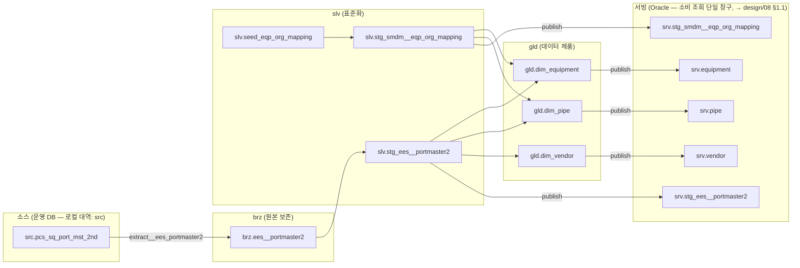

# LINEAGE — 전 경로 계보 (자동 생성 — 직접 수정 금지)

생성: `platform/infra/` 에서 `python ops/render_lineage.py` — manifest 갱신 시 함께 재생성한다.
실행 순서·의존은 Airflow `manager__pcs_transform` Graph, 테이블 계보는 OpenMetadata 리니지가 정본이고,
이 문서는 오프라인·코드리뷰용 스냅샷이다 (→ GUIDE.md §계보·의존성 어디서 보나).

